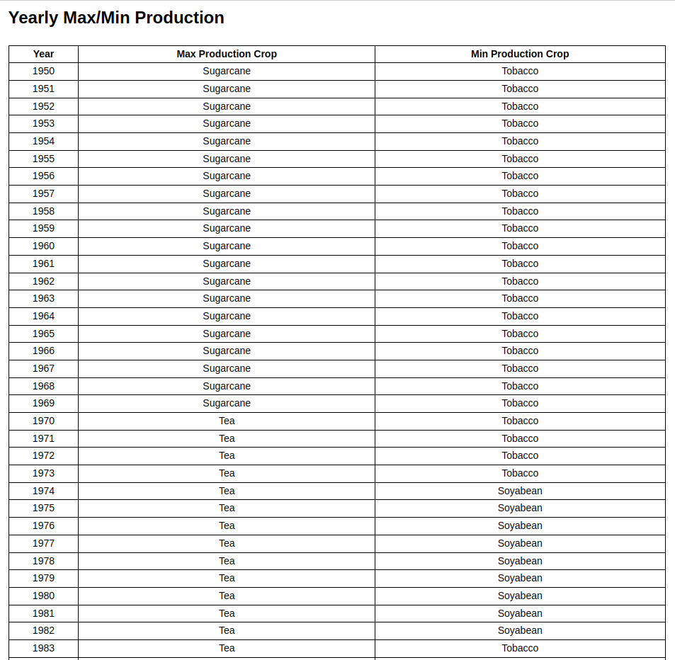
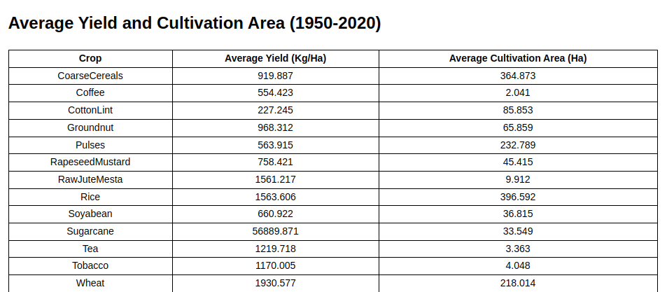

# Agriculture Analytics

This project performs analytics over the Indian Agriculture dataset and displays the results in tables.

## How to Run

1. Clone the repository.
2. Navigate to the project directory.
3. Install dependencies using `yarn install`.
4. Start the project using `yarn start`.

## Tables

### Yearly Max/Min Production

### Average Yield and Cultivation Area

